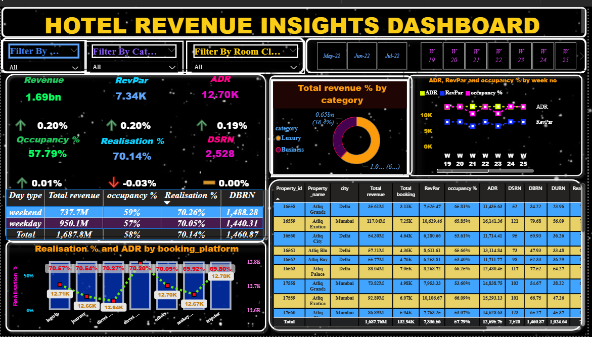

# 🏨 Hotel Revenue Analysis Dashboard

## 📌 Project Overview

This Power BI dashboard provides insights into hotel revenue performance, occupancy trends, booking behavior, and key hospitality metrics.

## 🛠 Tools Used

- Power BI
- Excel
- DAX

## 📊 Dashboard Preview

## 📈 Key Metrics

- Revenue
- ADR (Average Daily Rate)
- RevPAR
- Occupancy %
- Realisation %
- DSRN
- DBRN

## 🔍 Key Insights

- Weekend occupancy is slightly higher than weekdays.
- Luxury and Business categories contribute significantly to revenue.
- Revenue performance varies across properties and cities.
- ADR and RevPAR trends can be tracked weekly.

## 🎯 Business Objective

To help hotel management monitor performance, optimize occupancy, and improve revenue generation through data-driven decisions.

## 👨‍💻 Author

Arpan Jain
